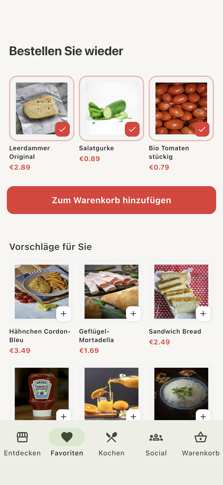
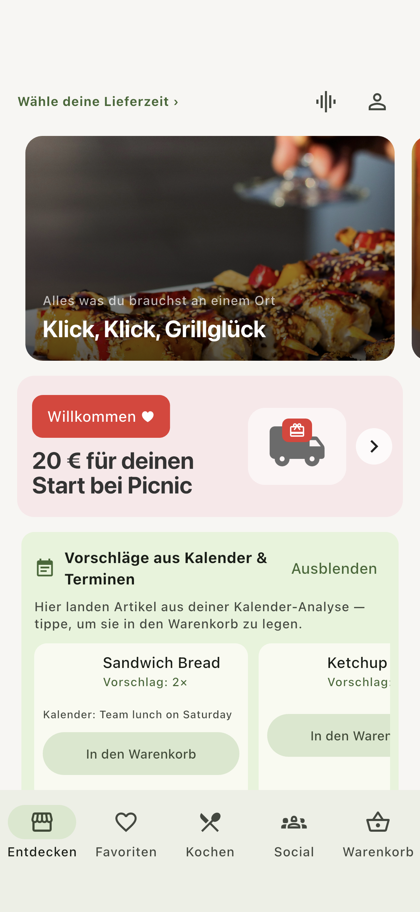
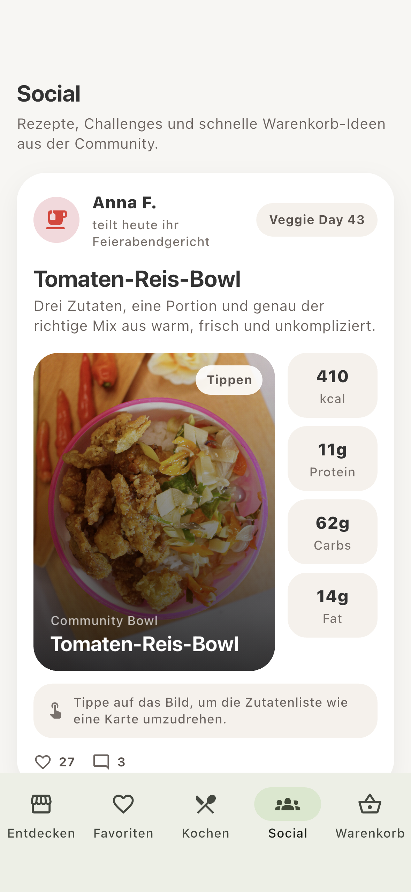

# qhack-picnic

`qhack-picnic` is a Flutter prototype for a faster Picnic grocery journey.
The current app focuses on three improvements over the earlier baseline:

- one-tap quick add from favorites
- external input integrations for basket building
- a new social feed with recipe and challenge actions

This repo contains the mobile client. Some integrations depend on local backend endpoints being available during demos.

## Implemented Now

### 1. One-tap quick add

The app now has a simple bulk-add flow in **Favoriten**.
Users can reopen a familiar basket and add the preselected items to the cart with one tap.

### 2. Hook and plugin integrations

The app now supports external input flows that help turn plans into basket items.

- **Google Calendar** is wired into the app. It reads upcoming events, sends the extracted text to `/api/extract`, and shows the results as suggestions on **Entdecken** before the user adds them manually.
- **External hook/plugin sources** are handled through the shared wishlist queue (`/api/wishlist/next` and `/api/wishlist/confirm`). In the current demo setup, this is the path used for sources such as WhatsApp. This repo contains the client-side queue handling, not a native WhatsApp-specific UI.

### 3. Social feed

The old search tab has been replaced with a **Social** tab.
It currently includes:

- a recipe post that can add its ingredient set to the basket
- a community challenge card that can add a starter kit to the basket

## Quick Start

- Boot the simulator: `./scripts/boot_simulator.sh`
- Build the iOS app for simulator: `./scripts/build.sh`
- Build the iPhone app for device handoff: `./scripts/build_device.sh`
- Run Flutter tests: `./scripts/test.sh`
- Build, install, and launch in simulator: `./scripts/run.sh`

## Requirements

- Flutter SDK
- Xcode
- iOS Simulator
- CocoaPods

If Flutter is not on `PATH`, set `FLUTTER_BIN`.
The repo also checks these common locations:

- `.fvm/flutter_sdk/bin/flutter`
- `~/.local/flutter/bin/flutter`
- `/opt/homebrew/bin/flutter`
- `/opt/homebrew/share/flutter/bin/flutter`

## Notes On The Current Demo Setup

- The preferred local simulator is `iPhone 14 Pro`.
- Calendar suggestions need the backend and Google sign-in flow to be available.
- Queue-based external inputs depend on the backend endpoints being reachable.
- The screenshots above were captured from the current simulator build in this repo.

## iPhone Handoff

- Run `./scripts/build_device.sh` to verify the iPhone target compiles.
- Open [ios/Runner.xcworkspace](/Users/naveenmalla/Work/Personal/qhack-picnic/ios/Runner.xcworkspace) in Xcode.
- Choose your Apple team under Signing & Capabilities if needed.
- Connect the iPhone, pick it as the run destination, and press Run in Xcode.
